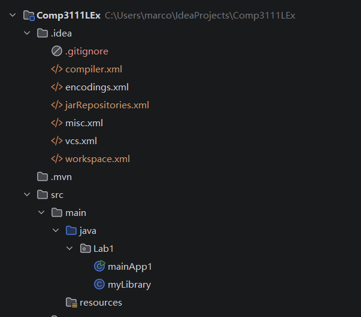
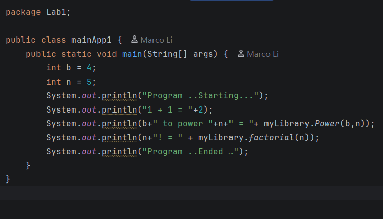
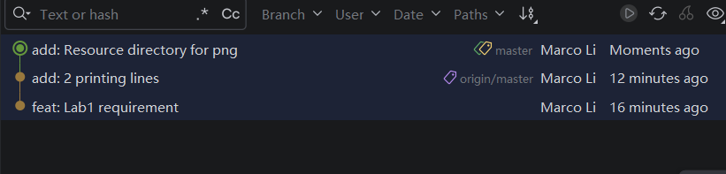

# COMP3111 Lab1
---
### Description
This repo is created for the coursework of HKUST COMP3111 - Software Engineering, teaching students how to manage Java projects on **Intellij** with **Maven** and **Git Version Control**

### Lab Assignment
This Lab requires us to take 3 screenshots in Intellij IDEA, that is

- The spanning tree of .idea and .src
- The editor view of myLibrary.java or mainApp1.java
- The Git Log 
 

---
**a) Spanning Tree**

---
**b) Editor View**

---
c) **Git Log**

